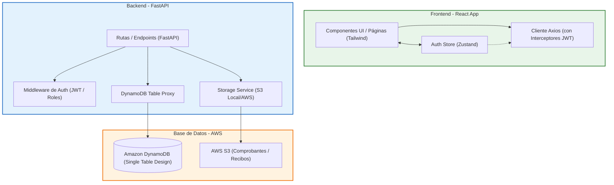

# Gestor de Gastos Agrícolas 🌾

Sistema integral para la gestión y control de gastos, presupuestos, ciclos de cultivo e inventario, optimizado para operaciones agrícolas (producción de jitomate y afines). Desarrollado con un frontend moderno en React (Vite + TypeScript + TailwindCSS) y un backend robusto en Python (FastAPI + DynamoDB).

---

## 📐 1. Diagrama de Arquitectura del Sistema

El sistema sigue una arquitectura desacoplada basada en microservicios ligeros en el Backend y una SPA (Single Page Application) reactiva en el Frontend.



### Flujo de Autenticación y Transacciones:
1. El usuario se autentica en la interfaz enviando sus credenciales a `/api/auth/login`.
2. El servidor valida la contraseña usando `bcrypt`, genera un par de tokens JWT (Access & Refresh) y los retorna al cliente.
3. El frontend almacena el token de sesión usando Zustand y persiste el `refresh_token` en `localStorage`.
4. El Interceptor de Axios añade automáticamente la cabecera `Authorization: Bearer <token>` a cada solicitud de recursos protegidos.
5. El backend intercepta la petición, verifica la firma del token y valida si el rol del usuario (`Admin`, `Gerente`, `Supervisor`, `Trabajador`) tiene permisos necesarios para interactuar con la base de datos a través del proxy.

---

## 💾 2. Modelo de Datos de DynamoDB (Diseño Single-Table)

El proyecto utiliza un diseño de **Tabla Única (Single-Table Design)** en DynamoDB para maximizar la velocidad de lectura y simplificar las relaciones relacionales sin necesidad de múltiples tablas. La tabla principal se llama `Control_Gastos`.

### Índices de la Tabla:
* **Primary Key (Llave Primaria Compuesta):**
  * **Partition Key (PK):** `gasto_id` (String)
  * **Sort Key (SK):** `fecha_gasto_id` (String)
* **Global Secondary Index (GSI):**
  * **Nombre:** `EmailIndex`
  * **Partition Key:** `email` (String)
  * **Sort Key:** Ninguno (Proyecta todos los atributos para búsquedas rápidas de usuarios).

### Mapeo de Entidades en la Tabla Única:

| Entidad (`entity_type`) | Valor de Partition Key (`gasto_id`) | Valor de Sort Key (`fecha_gasto_id`) | Atributos Específicos / Adicionales |
| :--- | :--- | :--- | :--- |
| **USER** | `user_<uuid>` | `PROFILE` | `email`, `full_name`, `password` (hashed), `role`, `currency`, `theme`, `default_plot_id`, `default_crop_cycle_id` |
| **EXPENSE** | `<uuid>` | `<date>` (e.g. `2026-06-08`) | `amount`, `description`, `category`, `subcategory`, `crop_cycle` (ID), `plot_id`, `provider_name`, `receipt_url` |
| **CATEGORY** | `cat_<uuid>` | `CATEGORY` | `name`, `icon`, `color`, `subcategories` (List), `priority` |
| **BUDGET** | `bud_<uuid>` | `BUDGET#<month_or_cycle>` | `category_id`, `month`, `crop_cycle_id`, `amount`, `spent` |
| **PLOT** (Lote) | `plot_<uuid>` | `PLOT` | `name`, `type` (`invernadero`, `suelo_abierto`, `hidroponia`), `hectareas`, `capacidad_plantas` |
| **CROP_CYCLE** | `cycle_<uuid>` | `CROP_CYCLE` | `name`, `start_date`, `end_date`, `hectareas`, `variety`, `plot_id`, `total_harvest_kg`, `status` |
| **INVENTORY_ITEM** | `inv_<uuid>` | `INVENTORY_ITEM` | `name`, `category`, `unit`, `current_stock`, `average_cost`, `date_added`, `provider_name` |
| **INVENTORY_TRANSACTION**| `tx_<uuid>` | `INVENTORY_TRANSACTION` | `item_id`, `transaction_type` (`IN`/`OUT`), `quantity`, `unit_cost`, `total_cost`, `date`, `related_entity_id`, `notes` |
| **PROVIDER** | `prov_<uuid>` | `PROVIDER` | `name`, `contact_name`, `phone`, `email`, `service_type`, `notes`, `products` (List) |
| **ALERT** | `alert#<budget_id>#<threshold>` | `ALERT` | `budget_id`, `category_name`, `month`, `spent`, `limit`, `percentage`, `message`, `date_triggered`, `resolved` |
| **BLACKLIST** (Token) | `blacklist#<token_signature>`| `BLACKLIST` | `token` (Guardado al hacer logout) |

---

## 🚀 3. Guía de Instalación y Configuración Local

### Requisitos Previos:
* Python 3.10 o superior instalado.
* Node.js v18 o superior con npm.
* Acceso a una tabla de DynamoDB o credenciales de AWS.

### Paso 1: Configurar el Backend (FastAPI)
1. Navega a la carpeta del backend:
   ```bash
   cd backend
   ```
2. Crea y activa un entorno virtual de Python:
   ```bash
   python -m venv .venv
   # En Windows (PowerShell):
   .\.venv\Scripts\Activate.ps1
   # En Linux/macOS:
   source .venv/bin/activate
   ```
3. Instala las dependencias necesarias:
   ```bash
   pip install -r requirements.txt
   ```
4. Configura el archivo de entorno `.env` en la carpeta `backend/`. Crea un archivo llamado `.env` basándote en la siguiente plantilla:
   ```env
   AWS_ACCESS_KEY_ID=tu_aws_access_key
   AWS_SECRET_ACCESS_KEY=tu_aws_secret_key
   AWS_DEFAULT_REGION=us-east-1
   AWS_S3_BUCKET_NAME=api-gastos
   ```
5. Inicia el servidor de desarrollo del backend:
   ```bash
   uvicorn main:app --reload
   ```
   El backend estará disponible en `http://127.0.0.1:8000`. Puedes acceder a la documentación interactiva (Swagger) en `http://127.0.0.1:8000/docs`.

### Paso 2: Configurar el Frontend (React + Vite)
1. Abre una nueva terminal y navega a la carpeta del frontend:
   ```bash
   cd frontend
   ```
2. Instala las dependencias del proyecto:
   ```bash
   npm install
   ```
3. Inicia el servidor de desarrollo de Vite:
   ```bash
   npm run dev
   ```
   El frontend estará disponible en `http://localhost:5173` o `http://localhost:5174`.

---

## 🛠️ 4. Comandos Disponibles

### Backend:
* `uvicorn main:app --reload`: Ejecuta el servidor del API con recarga automática al detectar cambios.
* `pip freeze > requirements.txt`: Guarda las dependencias actuales instaladas en el entorno virtual.

### Frontend:
* `npm run dev`: Ejecuta la aplicación de React en modo de desarrollo local.
* `npm run build`: Compila y optimiza la aplicación para producción en la carpeta `dist`.
* `npm run lint`: Ejecuta ESLint para analizar errores de estilo y código en los archivos de TypeScript.
* `npm run preview`: Previsualiza localmente el build de producción generado.

---

## 📖 5. Guías de Usuario (Paso a Paso)

### Guía A: Registrar un Nuevo Gasto Agrícola
> [!IMPORTANT]
> Para registrar un gasto asociado a un invernadero o ciclo de cultivo específico, asegúrate de haber creado primero el invernadero (lote) y el ciclo en sus respectivas secciones.

1. Inicia sesión en la aplicación.
2. Ve a la sección **Gastos** en el menú de navegación superior.
3. Haz clic en el botón **+ Nuevo Gasto**.
4. Rellena el formulario:
   * **Monto ($):** Ingresa la cantidad monetaria (ej. `25000`).
   * **Fecha:** Selecciona la fecha en la que se realizó la transacción.
   * **Categoría:** Selecciona una categoría (ej. *🌱 Insumos agrícolas*).
   * **Subcategoría:** Selecciona la subcategoría dependiente (ej. *Fertilizantes*).
   * **Descripción:** Escribe un breve resumen de la compra (ej. *Compra de fertilizante NPK para ciclo Primavera*).
   * **Lote / Invernadero (Opcional):** Selecciona el invernadero donde se aplicará.
   * **Ciclo de Cultivo (Opcional):** Asigna el gasto al ciclo activo correspondiente.
5. Haz clic en **Guardar**. El presupuesto de la categoría seleccionada se actualizará automáticamente en segundo plano. Si el consumo supera el 80% o 100% del presupuesto mensual, se disparará una alerta visual.

### Guía B: Dar de Alta un Invernadero (Lote)
> [!NOTE]
> Esta acción solo está permitida para usuarios con roles de **Admin** o **Gerente**.

1. Navega a la sección **Lotes** en el menú superior.
2. Haz clic en el botón **+ Nuevo Lote**.
3. Ingresa los datos solicitados:
   * **Nombre:** Elige un identificador descriptivo (ej. *Invernadero Norte 1*).
   * **Tipo:** Elige entre *Invernadero*, *Suelo abierto* o *Hidroponía*.
   * **Hectáreas:** Tamaño físico del lote en hectáreas (ej. `2.5`).
   * **Capacidad de Plantas:** Cantidad de plantas que soporta (ej. `15000`).
4. Haz clic en **Guardar**. El lote quedará registrado y disponible para asignarle gastos y ciclos de cultivo.

### Guía C: Iniciar y Finalizar un Ciclo de Cultivo
> [!NOTE]
> Solo visible y operable para roles de **Admin**, **Gerente** y **Supervisor**.

#### Para Iniciar un Ciclo:
1. Ve a la sección **Ciclos** en la navegación.
2. Haz clic en **+ Nuevo Ciclo**.
3. Rellena los datos de la siembra:
   * **Nombre del Ciclo:** (ej. *Primavera-Verano 2026*).
   * **Variedad:** Tipo de semilla/jitomate (ej. *Rafaello*).
   * **Lote / Invernadero:** Asigna el invernadero donde se sembrará.
   * **Hectáreas del ciclo:** Hectáreas productivas reales.
   * **Fecha de Inicio:** Fecha de plantación.
4. Presiona **Guardar**. El ciclo iniciará con estado `ACTIVE`.

#### Para Finalizar el Ciclo y Registrar Cosecha:
1. Dentro de la sección **Ciclos**, localiza el ciclo activo.
2. Haz clic en el botón de edición o de finalización (según la interfaz).
3. Cambia el estado del ciclo a `COMPLETED`.
4. Rellena el campo **Cosecha Total (Kg):** Ingresa la cantidad total de kilogramos recolectados al terminar la temporada (ej. `225000`).
5. Guarda los cambios. El sistema computará automáticamente el costo total acumulado del ciclo contra los kilos producidos para entregar el **Costo Real por Kilogramo Producido** en los KPIs.

### Guía D: Registrar Consumo de Inventario
1. Ve a la sección **Inventario** en el menú principal.
2. En la lista de insumos disponibles, haz clic en **Consumir / Registrar Salida** sobre el insumo deseado (ej. *Fertilizante NPK*).
3. Rellena la información de consumo:
   * **Cantidad a Consumir:** Cantidad de unidades a retirar del inventario.
   * **Ciclo de Cultivo:** Selecciona a qué ciclo productivo se le imputará este consumo.
   * **Notas:** Escribe comentarios adicionales (ej. *Aplicación de riego semanal*).
4. Haz clic en **Aceptar**.
   * El stock del insumo disminuirá inmediatamente en el inventario general.
   * Se creará una transacción de salida (`OUT`) en el historial del inventario.
   * Se registrará automáticamente un gasto asociado en segundo plano para reflejar el impacto financiero en el ciclo y categoría correspondientes.